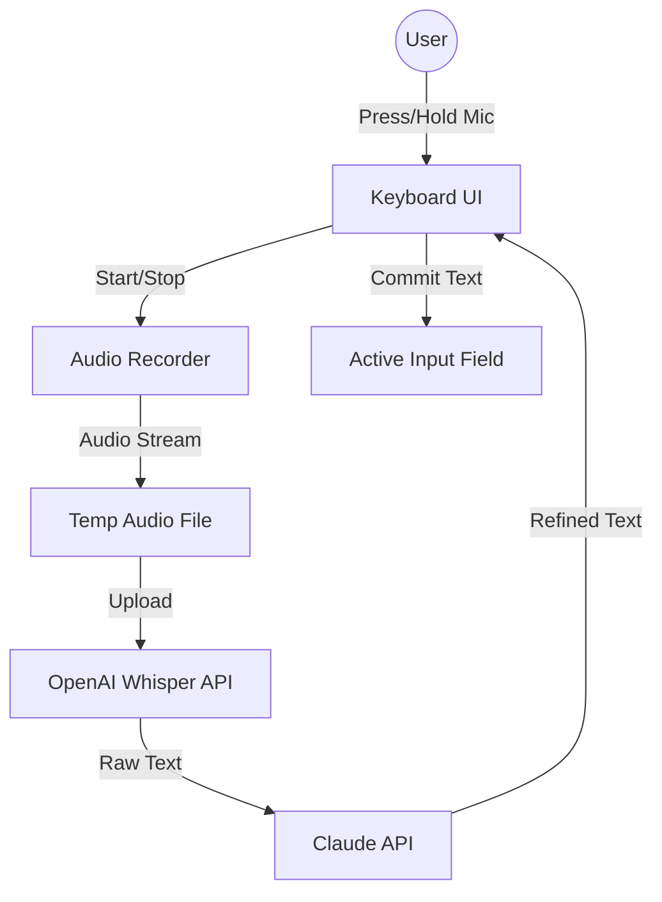

# WhisperDroid Architecture

## Technical Overview
- **Language**: Kotlin
- **UI Framework**: Jetpack Compose
- **Min SDK**: 24 (Android 7.0)
- **Target SDK**: 34 (Android 14)

## System Overview

WhisperDroid is an Android Input Method Editor (IME) that integrates high-quality voice-to-text using OpenAI's Whisper and Claude for text refinement.

## Module Structure

The project is organized into the following Gradle modules:

- **:app**: The main application module containing the Settings UI, Setup Wizard, and App-level configuration.
- **:keyboard**: Contains the `InputMethodService` implementation, Jetpack Compose keyboard layouts, and the Input Method logic.
- **:api**: A library module for handling networking with OpenAI and Claude. Contains Retrofit interfaces and data models.
- **:core**: Shared utilities, base classes, and domain models used across modules.
- **:security**: Handles encrypted storage and key management.

## Component Responsibilities

### Keyboard Module
- **WhisperDroidIME**: Extends `InputMethodService`. Manages the keyboard lifecycle and interacts with the `InputConnection`.
- **KeyboardViewModel**: Manages the state of the keyboard UI (keys, shifts, symbols, and voice states).
- **AudioHandler**: Manages `AudioRecord` or `MediaRecorder` for capturing voice input.

### API Module
- **OpenAIClient**: Handles authentication and requests to the Whisper transcription endpoint.
- **ClaudeClient**: Handles requests to the Claude Messages API for text cleanup.
- **NetworkManager**: Manages connectivity checks and offline state handling.

### App Module
- **SettingsActivity**: Allows users to input and test their API keys.
- **SetupWizard**: Guides users through enabling the keyboard in Android settings.

## Data Flow

1. **Input Stage**: User holds the microphone button. `AudioHandler` begins recording to a local cache file.
2. **Transcription Stage**: On release, the recorded file is sent to the OpenAI Whisper API.
3. **Refinement Stage**: The raw transcription is sent to Claude with a system prompt optimized for correcting grammar and formatting (e.g., adding punctuation).
4. **Output Stage**: The final text is inserted into the active text field via `InputConnection.commitText()`. If no active input field is detected, the text is optionally copied to the clipboard.

## Security Model

- **API Key Storage**: API keys are stored using `EncryptedSharedPreferences` from the Android Jetpack Security library. This ensures keys are encrypted at rest using the Android Keystore system.
- **Permissions**:
    - `RECORD_AUDIO`: Required for voice input.
    - `INTERNET`: Required for API communication.
    - `POST_NOTIFICATIONS`: (Optional) For showing recording status.
- **Data Privacy**: Audio files are stored in the app's internal cache and deleted immediately after successful transcription or on error.

## Threading Model

WhisperDroid follows a strict threading model to ensure keyboard responsiveness:

- **Main (UI) Thread**: Handles Jetpack Compose rendering and user interactions.
- **Audio Thread**: Dedicated high-priority thread for capturing audio samples without jitter.
- **IO Thread Pool**: Managed via Kotlin Coroutines (`Dispatchers.IO`) for:
    - Networking (API calls).
    - Disk I/O (Saving/reading temporary audio files).
    - Preference access.
- **Computation Thread**: For any heavy text processing or parsing if needed.
